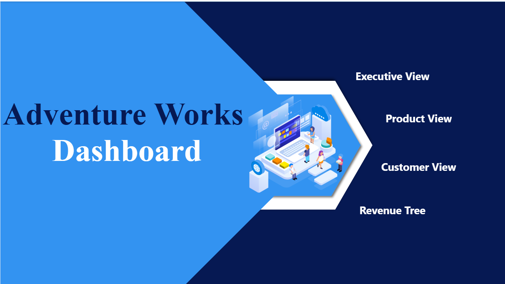
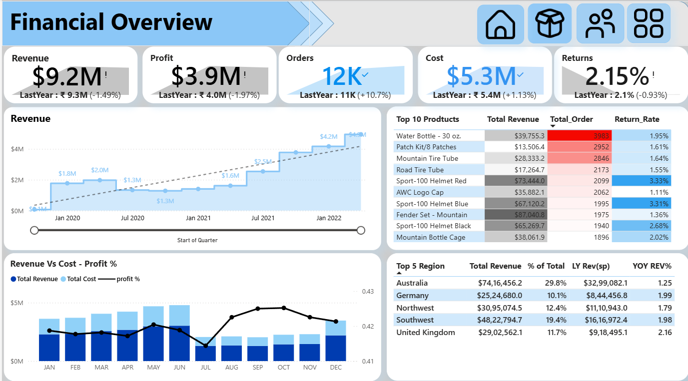
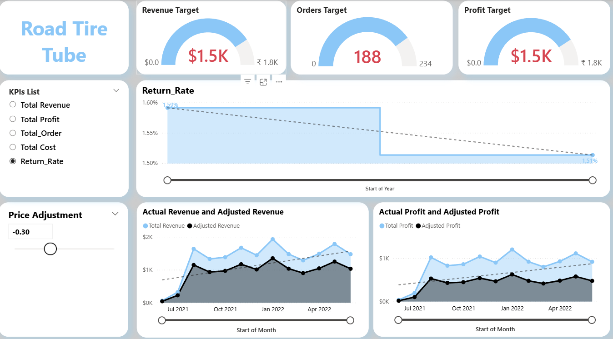
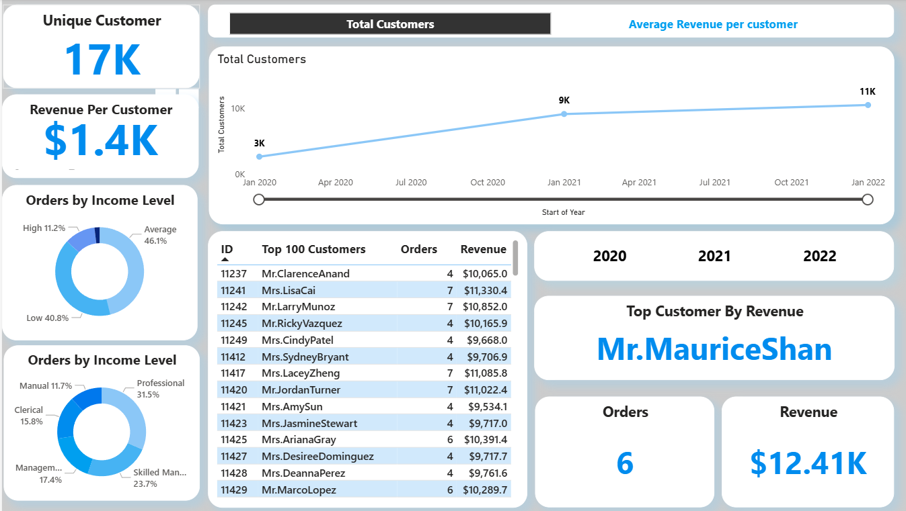
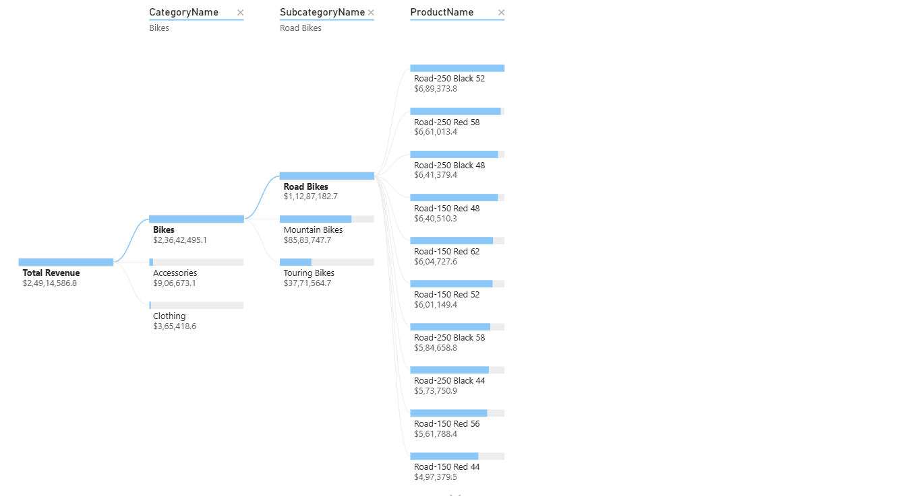

# 📊 Adventure Works Dashboard

This project presents an **interactive business intelligence dashboard** built on the **Adventure Works dataset**. The dashboard provides a **comprehensive financial, sales, and customer overview**, helping stakeholders make data-driven decisions.

---

## 🛠️ Project Workflow

1. **Data Cleaning & Preparation**

   * Used **Power Query** to clean and transform raw Adventure Works data.
   * Handled missing values, standardized column names, and created calculated fields.
   * Prepared fact and dimension tables for reporting.

2. **Dashboard Development**

   * Built in **Power BI** using cleaned datasets.
   * Created relationships between tables for better drill-down analysis.
   * Implemented slicers, filters, and interactive charts for dynamic insights.

---

## 📈 Dashboard Features

### 🔹 Executive View

* High-level KPIs: **Revenue, Profit, Orders, Cost, Returns**
* Year-over-year comparisons with percentage changes
* Key financial trends displayed in cards and graphs

### 🔹 Product View

* Top 10 products by **Revenue, Orders, and Return Rate**
* Product-level revenue vs cost vs profit margin
* Trends in sales performance by product category

### 🔹 Customer View

* Total and unique customers
* **Revenue per customer** insights
* Orders segmented by **Income Level**
* Top customers by **Revenue** contribution

### 🔹 Revenue Tree

* Comparison of **Actual vs Adjusted Revenue & Profit**
* Regional breakdown with **Top 5 Regions**
* **YOY growth metrics** to track performance

---

## 📊 Key Visuals

* KPI Cards (Revenue, Profit, Orders, Cost, Returns)
* Trend charts (Revenue & Profit over time)
* Bar & Line combo charts (Revenue vs Cost vs Profit %)
* Donut charts (Orders by Income Level)
* Tables (Top Customers, Top Products)
* Gauges (Targets vs Actuals)

---

## 🚀 How to Use

1. Download the `.pbix` file from this repository.
2. Open it in **Power BI Desktop**.
3. Connect to the Adventure Works dataset (or refresh if already linked).
4. Explore the dashboard using slicers and filters.

---

## 📌 Tools & Technologies

* **Power BI** – Data visualization & dashboard creation
* **Power Query** – Data cleaning & transformation
* **Adventure Works Dataset** – Sample business dataset

---

## 📷 Preview

  
 
  
 
  
---

## 🛠️ Future Enhancements

* Add forecasting models for sales and revenue trends
* Create a mobile-friendly layout of the dashboard
* Integrate real-time data sources (SQL Server, Azure, etc.)

---

## 👤 Author

Developed as part of a **Business Intelligence & Data Analytics project** to showcase skills in **Power Query, Data Cleaning, and Dashboard Design**.
